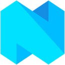

# Nodal
## Web Servers Made Easy With Node.js

[](https://travis-ci.org/keithwhor/nodal)

Nodal is a web server for Node.js that was built with the sole purpose of making
the developer's life easier.



Boasting its own opinionated, explicit, idiomatic and
highly-extensible full-service framework, Nodal takes care of all of the hard
decisions for you and your team. This allows you to focus on creating an effective
product in a short timespan while minimizing technical debt.

Nodal projects are ready to deploy to [Heroku](https://heroku.com) right out of
the box, so you can have your website live in no time.

## Why Nodal?

Nodal is built upon an ideology of a robust, scalable microservice architecture.
It can deliver solutions for every part of your system.  From a simple HTTP service
that provides server-generated HTML, to an API Server, to a scaffold for building
Single Page Applications, you can spin up a Nodal server for anything.

Nodal servers are not meant to be monoliths. They're meant to be modular and
distinct. Ideally, you should only use a subset of Nodal's features per project,
and have multiple Nodal projects that are loosely-coupled and interface with
one another (brandind webserver, API server, application server). You can
[read more about specific types of servers](#server-types) and where you'd use
them, if you're interested.

Due to this modularity, Nodal should never feel restrictive. It is not a silver
bullet. It is meant as an entry point into distributed, modern web architectures.
Once you're familiar with building these sorts of systems, swap in or swap out Nodal
wherever you please.

## Getting Started

Getting started with Nodal is easy.

1. Download and install the newest Node 5.x version from [nodejs.org](https://nodejs.org)
2. Open terminal, and type `npm install nodal -g`.
3. Using your terminal, visit your projects folder. Perhaps with `cd ~`.
4. Run `nodal new`.
5. Follow the on screen instructions, enter your new project directory and type `nodal s`.

That's it! Your Nodal webserver is up and running.

## Hooking Up Your Database

Once Nodal is up and running, it's likely that you'll want to connect your project
to a database. Nodal comes packaged with Migrations, a Query Composer and full
PostgreSQL integration.

First you'll need to install PostgreSQL. OS X users, I recommend using
[Postgres.app](http://postgresapp.com/) for your development environment.

Once you've installed Postgres, make sure to run:

```
$ createuser postgres -s
```

To create a default postgres superuser with no password. (Default for Nodal's
configuration.)

To begin using your database, start with:

```
$ nodal db:create
```

To create the database and then,

```
$ nodal db:prepare
```

To prepare for migrations.

From here, `nodal db:migrate` runs all pending migrations and `nodal db:rollback`
will roll back migrations, one at a time by default.

## Server Types

Nodal works best when you follow its ideology, and that means creating a new
Nodal server to solve specific *Problem Domains* of your application and business.

The main three suggestions are **Branding Server**, **API Server** and **Application Server**.

This ideology is focused around a distributed, fault-tolerant, loosely-coupled
systems designed where no single service is dependent upon any other one. If a
junior developer accidentally brings down your Branding Server, for example, your
API and Application still work perfectly.

### Brandings Server

This is your Google-able, SEO-indexed server for your product or service,
containing your branding pages. Use Nodal's Templates and partials (using doT.js)
to show your users server-generated HTML pages that serve as a great introduction
to what you're showing off. If you need to grab live data from an API, send
asynchronous non-blocking requests to your API Server.

Here's the controller for a sample index page:

```javascript
class IndexController extends Nodal.Controller {

  get() {

    this.render(
      this.app.template('index.html').generate(
        this.params,
        {
          test: this.params.query.test,
          name: 'My Nodal Application'
        }
      )
    );

  }

}
```

### API Server

Create an API server using Nodal's Models, PostgreSQL integration, built-in JSON
API formatting, and Query Composer (ORM). Bi-directional migrations are packaged
with Nodal, meaning you can maintain the integrity of your data.
User (including password) and OAuth AccessToken models and controllers are
pre-built for you and can be added easily to your project.

Packaged with Nodal are workers, scheduling modules, and much more for all of
your data needs.

We can look at what an API Controller might look like for, say, blog posts:

```javascript
class BlogPostsController extends Nodal.Controller {

  index() {

    BlogPost.query()
      .join('user')
      .join('comments')
      .where(this.params.query)
      .end((err, blogPosts) => {

        this.respond(err || blogPosts);

      });

  }

  show() {

    BlogPost.find(params.id, (err, blogPost) => this.respond(err || blogPost));

  }

  create() {

    BlogPost.create(params.body.data, (err, blogPost) => this.respond(err || blogPost));

  }

  update() {

    BlogPost.update(params.id, params.body.data, (err, blogPost) => this.respond(err || blogPost));

  }

  destroy() {

    BlogPost.destroy(params.id, (err, blogPost) => this.respond(err || blogPost));

  }

}
```

### Application Server

Use Nodal's Initializers to specify asset compilation for your single page
web applications. Use modules like [nodal-angular](https://github.com/keithwhor/nodal-angular)
or roll your own. Interface with your Nodal API server dynamically to provide a
great user experience.

## Beginner's Guide

Website incoming, you'll be able to learn more about Nodal at [nodaljs.com](http://nodaljs.com).

## Documentation

Nodal has the majority if its important methods fully documented inline, in the
codebase. You will be able to find this translated and prettified at
[nodaljs.com](http://nodaljs.com).

## About

Nodal is under active development and maintained by
[Keith Horwood](http://keithwhor.com).

**Contributors welcome!**

Follow me on Twitter, [@keithwhor](http://twitter.com/keithwhor)

Fork me on GitHub, [keithwhor](http://github.com/keithwhor)

Thanks for checking out Nodal!
